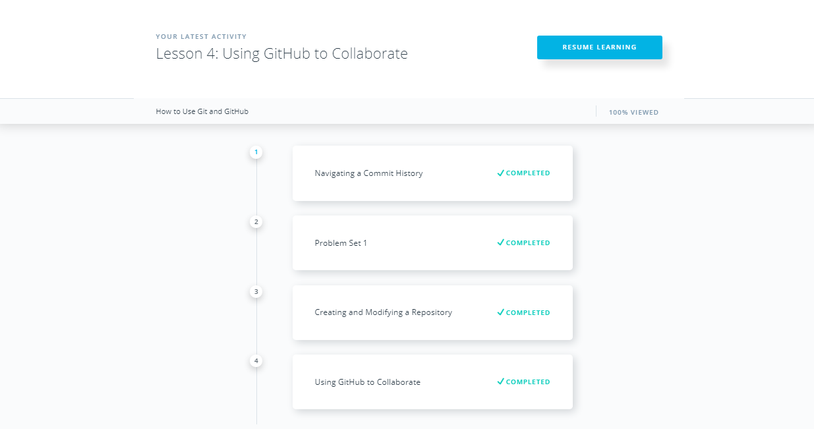

# kottans_frontend
:octocat: Kottans frontend course 🎓

**Task 0**

- [x] [How to use Git and GitHub](https://www.udacity.com/course/how-to-use-git-and-github--ud775)

  It was interesting to me, especially lesson 4 about collaborating. Also, I understand better how git works in general and how to  organize commits in a better way.
  
	