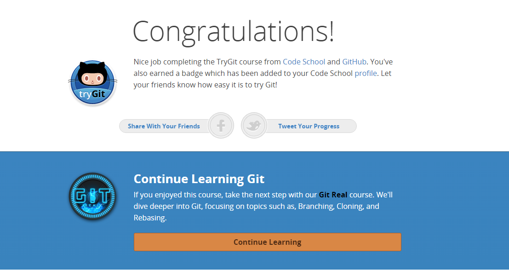
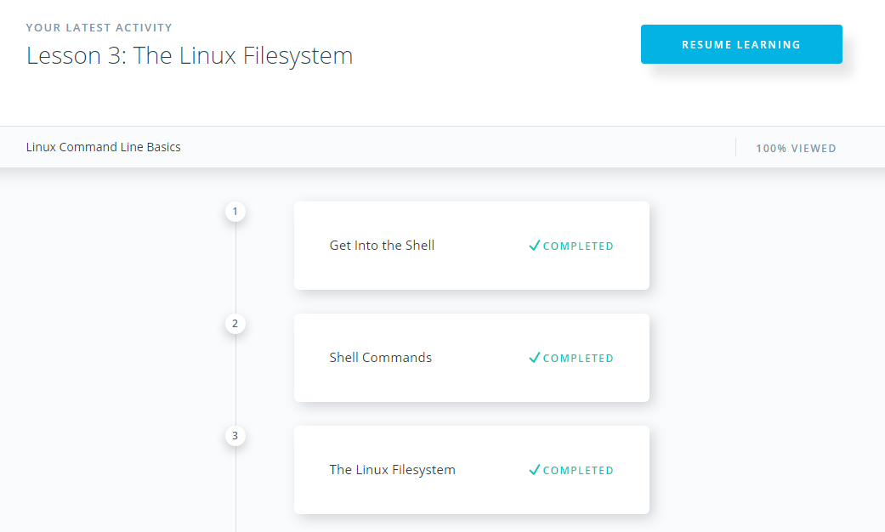

# kottans_frontend
:octocat: Kottans frontend course 🎓

**Task 0**

- [x] [How to use Git and GitHub](https://www.udacity.com/course/how-to-use-git-and-github--ud775)

  It was interesting to me, especially lesson 4 about collaborating. Also, I understand better how git works in general and how to  organize commits in a better way.
  
	
	
- [x] [Try Git](https://try.github.io/levels/1/challenges/1)

  I learned new git commands: reset and rm when passed this tutorial.
  
	
	
- [x] Create pull request to [Kottans/mock-repo](https://github.com/kottans/mock-repo).

**Task 1**

- [x] [Linux Command Line Basics](https://www.udacity.com/course/linux-command-line-basics--ud595)
	It was simple and interesting course about console commands.
	
	